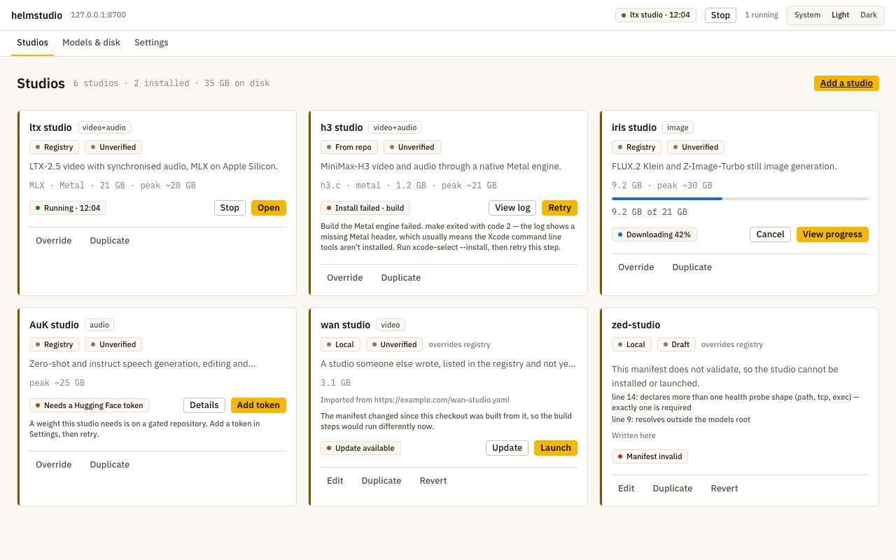

<div align="center">

# helmstudio

**A local launcher and platform for open-weight generative models.**

Install video, image and speech models from their own repositories, run them on your Mac,<br>
and keep everything they make in one place.

[](LICENSE)
[](go.mod)
[](#requirements)
[](#status)

[Documentation](https://helmstudio.in/docs/) ·
[Quickstart](https://helmstudio.in/docs/quickstart/) ·
[Architecture](docs/framework.md) ·
[Design](docs/design/00-index.md) ·
[Contributing](CONTRIBUTING.md)

</div>

<picture>
  <source media="(prefers-color-scheme: dark)" srcset="test/visual/golden/screen-catalogue-dark-1280.png">
  
</picture>

## What is helmstudio?

A **studio** is somebody else's repository that wraps an open-weight model — a
video model, an image model, a speech model — behind a web page of its own.
helmstudio installs a studio from a manifest, builds it, fetches its weights,
runs its processes, and gives every studio the same storage, gallery and
timeline, so what one studio makes is there for the next.

Two rules carry the design:

- **Studios stay independent repositories.** helmstudio never vendors, forks,
  patches or imports studio code. A studio stays fully usable by someone who
  clones it and ignores helmstudio entirely.
- **The daemon is never a model runtime.** No inference, no tensors, no Python
  in process. It fetches, builds, downloads, supervises, stores and serves;
  anything that has to understand a model format belongs in a studio.

## Features

- **Install from a manifest.** A studio describes itself in one
  `helmstudio.yaml`: how to build it, the weights it needs, the processes it
  runs and the platform services it asks for. The launcher shows what it will
  run before anything executes, clones at a pinned commit, and resumes a failed
  build from the step that failed.
- **Weights, downloaded or linked.** Hugging Face downloads check free space
  first, resume, and verify size and etag — or point a studio at a checkpoint
  you already have. Reclaiming disk shows exactly what it will free before it
  frees it.
- **Supervision.** Process groups on assigned ports, health checks with real
  timeouts, teardown in dependency order, live logs, and re-adoption of whatever
  was running if the daemon is killed. One heavy model is in memory at a time,
  and switching asks first.
- **A platform API for studios.** Sessions, settings and records;
  content-addressed assets adopted by hardlink, never copied; a gallery with
  provenance; jobs with progress and logs; events; and a timeline whose
  sequences export through ffmpeg. Every launch gets a capability-scoped token
  and a restricted environment.
- **Packages a studio can use, or ignore.** Theme tokens and components in
  light and dark, an API client in Go, Python and JavaScript, and ready-made
  gallery, player, terminal and timeline elements.
- **Tools for studio authors.** `helm validate` checks a manifest, scores it
  against the criteria a published studio is held to, and lints a studio's
  stylesheets against the theme. `helm dev` runs a studio under the same
  supervisor and API, with no daemon at all.
- **Local only.** Everything is served on loopback. No accounts and no
  telemetry: the only outbound calls are to GitHub and Hugging Face, and
  whatever a studio's own build fetches, when you install something.

## Studios

The registry in [`studios/`](studios) points at four studios, each in its own
repository:

| Studio | Makes | Built on |
|---|---|---|
| [h3 studio](https://github.com/janishar/h3c-studio) | video and audio | MiniMax-H3 on a native Metal engine, no PyTorch in the loop |
| [ltx studio](https://github.com/janishar/ltx-2-studio) | video and audio | LTX checkpoints on MLX |
| [iris studio](https://github.com/janishar/iris-studio) | images | FLUX.2 Klein and Z-Image on native Metal |
| [AuK studio](https://github.com/janishar/AuK) | speech and voice | AuK and AuK-Flash on PyTorch (mps) |

Any repository can become a studio: its manifest can live in the studio's own
repository, or be written in the launcher for a repository whose author never
wrote one.

## Status

helmstudio is **pre-release**. `1.0.0-rc.2` of the `helm` CLI, the packages and
the Mac app is published; the app is unsigned, and the launcher and its daemon
also run from a clone.

| | |
|---|---|
| **Built** | The daemon: supervision, install and weights, the platform API and its three clients. Python studios. The launcher, with its studio library, manifest editor and approval screen. The four components. The timeline and its export. The documentation site. The Mac app's shell — a native window around the launcher that starts the daemon or adopts one already running. |
| **Not built yet** | The Mac app's signature and notarisation — it is downloadable but unsigned — its auth cookie, and the ffmpeg and uv it should bundle. The launcher's own Gallery and Timeline screens. `helm test`, `helm doctor`, `helm adopt` and `helm studio init`. |
| **Verified on** | macOS on Apple Silicon. The Go code is type-checked for Linux on every gate run; nothing has been run there. |

[docs/releasing.md](docs/releasing.md) says what is published where.

## Requirements

- **macOS on Apple Silicon** to run the studios
- **Go 1.27.1** or newer, **git** and **make**
- **[uv](https://docs.astral.sh/uv/)**, for studios written in Python
- **ffmpeg** and **ffprobe**, for media probing, posters and timeline export
- A C toolchain, for studios that build native engines (each studio declares
  the tools it needs)
- Chrome, only for the visual-regression tests

## Getting started

```bash
git clone https://github.com/janishar/helmstudio
cd helmstudio
make build
```

`make build` writes `bin/helmstudio`, the daemon, and `bin/helm`, the CLI.

### Run the launcher

```bash
./bin/helmstudio
```

Then open **http://127.0.0.1:8700**. helmstudio keeps everything — its database,
assets, models, logs and the library of what you made — in `~/.helmstudio`. To
try it without touching that, give it a scratch tree:

```bash
HELMSTUDIO_HOME=/tmp/helmstudio-scratch ./bin/helmstudio
```

A model on a gated Hugging Face repository needs a token. Add it in
**Settings**: it is kept in the macOS Keychain, never in the database.

### The Mac app

`helmstudio.app` is a native window around the same launcher the browser shows.
It starts the daemon, adopts one that is already running, and on quit stops the
one it started — or leaves it running, if you asked it to keep studios alive.
Nothing is reachable only from the app.

**[Download helmstudio.app](https://github.com/janishar/helmstudio/releases)** —
`helmstudio-<version>.dmg` on the newest release, for macOS 14 or newer on Apple
Silicon. It bundles the daemon, so there is nothing else to install. Check it
against the release's `SHA256SUMS` if you like.

**It is unsigned**, and that matters at first launch. macOS quarantines what a
browser downloads, and for an unsigned app it reports the app as *damaged*
rather than as unsigned — which reads like a corrupt download and is not one.
After dragging it to Applications, clear the flag once:

```bash
xattr -dr com.apple.quarantine /Applications/helmstudio.app
```

Signing and notarisation need an Apple Developer ID, and until there is one that
step is yours to take. Nothing in the app needs it otherwise: the browser at
**127.0.0.1:8700** is the reference implementation, and `helm` or a clone runs
the same launcher with no dialog to dismiss.

To build it yourself instead — `bin/helmstudio.app` and a `.dmg` beside it, or
running it straight from the build with the daemon's output in your terminal:

```bash
make dmg
make app-run
```

### Write a studio

A studio is a manifest and a process. This is a whole one, from the
[quickstart](https://helmstudio.in/docs/quickstart/):

```yaml
id: hello-studio
name: hello studio
description: Makes a small image from a prompt, and records it with its parameters.
kinds: [image]
license: MIT
repo: https://github.com/you/hello-studio
requires:
  os: [darwin, linux]
  arch: [arm64, amd64]
  tools: [python3]
  ram_gb: 1
  disk_gb: 1
peak_ram_gb: 1
runtime:
  framework: other
  backends: [cpu]
sdk: { runtime: "^1" }
capabilities: [assets, gallery]
processes:
  - name: studio
    role: main
    cmd: "python3 studio.py --port {port}"
    port: { prefer: 8765 }
    health: { path: /healthz, timeout_s: 30 }
    ui: /
```

Install `helm` on macOS on Apple Silicon or on Linux, or put the clone's
`bin/helm` on your `PATH`:

```bash
/bin/bash -c "$(curl -fsSL https://raw.githubusercontent.com/janishar/helmstudio/main/installer/install.sh)"
```

The installer checks the download against the release's checksums and puts
`helm` in `~/.local/bin`; [Installing helm](docs/releasing.md#installing-helm)
says what else it checks, and how to uninstall it. `helm --version` says which
`helm` you have, and `helm upgrade` replaces it with a newer release. Then check
the manifest and run the studio from its own
directory:

```bash
helm validate -criteria helmstudio.yaml
helm dev -f helmstudio.yaml
```

`helm dev` serves the same platform API on a free local port, keeps the studio's
data in `./.helm`, and prints each process's output. The
[documentation](https://helmstudio.in/docs/) covers the manifest, recording
outputs with provenance, wrapping a repository you did not write, and the full
API, manifest and command reference.

## Packages

| Package | What it gives a studio | Languages |
|---|---|---|
| [`helm-runtime-sdk`](packages/helm-runtime-sdk) | A client for the platform API, generated from [one contract](api/openapi.yaml), and an embedded provider for Go studios that run on their own | Go, Python, JavaScript |
| [`helm-ui-sdk`](packages/helm-ui-sdk) | `helm-gallery`, `helm-player`, `helm-terminal` and `helm-timeline`, as custom elements | JavaScript |
| [`helm-css`](packages/helm-css) | Tokens, layout and component classes, in light and dark | CSS |

None of them is required: a studio that uses no package still installs,
launches and runs. They are published at `1.0.0-rc.1` on PyPI, npm and the Go
module proxy, and [docs/releasing.md](docs/releasing.md) gives the command that
installs each.

## How it fits together


```
cmd/helmstudio   the daemon
cmd/helm         the CLI: validate, dev, upgrade
installer/       install.sh and uninstaller.sh, which install and remove helm
internal/        daemon internals: platform, store, supervisor, install, weights, api
packages/        helm-css, helm-runtime-sdk (Go, Python, JavaScript), helm-ui-sdk
web/             the launcher's screens
schema/          manifest.json, the manifest contract
api/             openapi.yaml, the platform API contract, and its generator
studios/         the registry: one entry per studio
site/            the documentation site
docs/design/     the design, which is the contract
test/            the conformance, visual and media suites
```

## Documentation

- **[Documentation site](https://helmstudio.in/docs/)** — for studio authors;
  its source is in [`site/content/docs`](site/content/docs)
- **[Architecture guide](docs/framework.md)** — a map of the repository,
  from the bird's-eye view down
- **[Design](docs/design/00-index.md)** — the frozen design: an implementation
  that disagrees with it is wrong until the document changes
- **[Decision log](docs/decisions.md)** — what was decided, when and why
- **[Releasing](docs/releasing.md)** — what is published where, and how
- **[Publishing safely](docs/publishing.md)** — the setup each registry needs,
  and what keeps anyone else from publishing

## Contributing

Read [CONTRIBUTING.md](CONTRIBUTING.md) first. In short: the design documents
are the contract, and a contradiction in them is raised rather than resolved in
code; work happens on a `feat/`, `fix/` or `chore/` branch; and a change is done
when the gate is green.

```bash
make gate   # everything that must pass before a commit
make test   # the unit tests alone
```

## License

[MIT](LICENSE) © 2026 Janishar Ali
