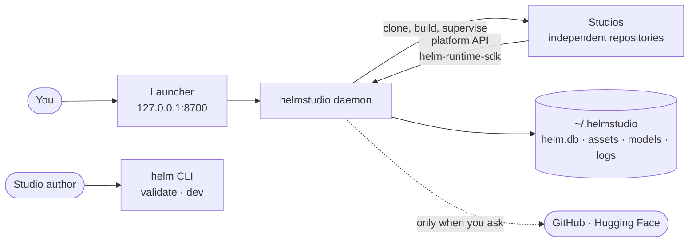

<div align="center">

# helmstudio

**A local launcher and platform for open-weight generative models.**

Install video, image and speech models from their own repositories, run them on your Mac,<br>
and keep everything they make in one place.

[](LICENSE)
[](go.mod)
[](https://helmstudio.in/docs/)
[](#status)

[Documentation](https://helmstudio.in/docs/) ·
[Quickstart](https://helmstudio.in/docs/quickstart/) ·
[Architecture](docs/framework.md) ·
[Design](docs/design/00-index.md) ·
[Contributing](CONTRIBUTING.md)

</div>

https://github.com/user-attachments/assets/e3896e6a-759a-45f9-a22b-de8c61f94e9b

<div align="center"><sub>The launcher's library screen. This is the visual-regression golden, drawn from the canned data in <code>test/visual/fixtures</code> — not a recording of a session.</sub></div>

## What is helmstudio?

A **studio** is somebody else's repository that wraps an open-weight model — a
video model, an image model, a speech model — behind a web page of its own.
helmstudio installs a studio from a manifest, builds it, fetches its weights,
runs its processes, and gives every studio the same storage, gallery and
timeline, so what one studio makes is there for the next.

Two rules carry the design:

- **Studios stay independent repositories.** helmstudio never vendors, forks,
  patches or imports studio code. A studio stays fully usable by someone who
  clones it and ignores helmstudio entirely.
- **The daemon is never a model runtime.** No inference, no tensors, no Python
  in process. It fetches, builds, downloads, supervises, stores and serves;
  anything that has to understand a model format belongs in a studio.

## Choose your path

**Run studios.** Build from a clone and open the launcher:

```bash
git clone https://github.com/janishar/helmstudio && cd helmstudio && make build && ./bin/helmstudio
```

Then open **http://127.0.0.1:8700**. Everything lives in `~/.helmstudio`; set
`HELMSTUDIO_HOME` to try it somewhere else. There is also an **unsigned**
[Mac app](https://github.com/janishar/helmstudio/releases) — a native window
around the same launcher, bundling the daemon. Being unsigned, macOS reports it
as damaged until you clear the quarantine flag once; the release notes give the
line.

**Update the Mac app from a clone.** `make app` builds the bundle — the Swift
shell, the daemon and the registry beside it — and installing it is a copy:

```bash
make app && osascript -e 'quit app "helmstudio"'; rm -rf /Applications/helmstudio.app && ditto bin/helmstudio.app /Applications/helmstudio.app && open -a helmstudio
```

Quit it before copying. A running daemon holds `127.0.0.1:8700`, so a new
bundle put over a running one serves the old code until that process goes —
and the page looks unchanged for reasons that have nothing to do with the
build. The bundle is ad-hoc signed for the machine that built it, which is
enough to run it there and not enough to move it anywhere else.

**Build a studio.** Install the `helm` CLI, then follow the quickstart:

```bash
/bin/bash -c "$(curl -fsSL https://raw.githubusercontent.com/janishar/helmstudio/main/installer/install.sh)"
```

[Install helm](https://helmstudio.in/docs/install-helm/) covers versions,
upgrading and uninstalling. [The quickstart](https://helmstudio.in/docs/quickstart/)
gets a studio of your own recording its first output.

**Contribute.** Read [CONTRIBUTING.md](CONTRIBUTING.md) first: the design
documents are the contract, a contradiction in them is raised rather than
resolved in code, work happens on a branch, and a change is done when
`make gate` is green. [docs/framework.md](docs/framework.md) is the map of the
repository, including what you need installed to build it.

## Status

helmstudio is **pre-release**. `1.0.0-rc.4` of the `helm` CLI, the packages and
the Mac app is published; the app is unsigned, and the launcher and its daemon
also run from a clone.

| | |
|---|---|
| **Built** | The daemon: supervision, install and weights, the platform API and its three clients. Python studios. The launcher, with its studio library, manifest editor and approval screen. The four components. The timeline and its export. The documentation site. The Mac app's shell — a native window around the launcher that starts the daemon or adopts one already running. |
| **Not built yet** | The Mac app's signature and notarisation — it is downloadable but unsigned — its auth cookie, and the ffmpeg and uv it should bundle. The launcher's own Gallery and Timeline screens. `helm test`, `helm doctor`, `helm adopt` and `helm studio init`. **Using one studio's work in another:** the platform has both routes — the `gallery.read_all` capability and `POST /handoff` into a studio's inbox — but no studio asks for either, so every picker is `scope="self"` and lists only its own takes. Until one does, the way across is the filesystem: takes are read-only files under `~/.helmstudio/library/<studio-id>/<year>-<month>/`, so an iris still can be browsed straight into ltx studio. |
| **Verified on** | macOS on Apple Silicon. The Go code is type-checked for Linux on every gate run; nothing has been run there. |

## Studios

The registry in [`studios/`](studios) points at four studios, each in its own
repository:

| Studio | Makes | Built on |
|---|---|---|
| [h3 studio](https://github.com/janishar/h3c-studio) | video and audio | MiniMax-H3 on a native Metal engine, no PyTorch in the loop |
| [ltx studio](https://github.com/janishar/ltx-2-studio) | video and audio | LTX checkpoints on MLX |
| [iris studio](https://github.com/janishar/iris-studio) | images | FLUX.2 Klein and Z-Image on native Metal |
| [AuK studio](https://github.com/janishar/AuK) | speech and voice | AuK and AuK-Flash on PyTorch (mps) |

Any repository can become a studio: its manifest can live in the studio's own
repository, or be written in the launcher for a repository whose author never
wrote one.

## Packages

None of them is required: a studio that uses no package still installs,
launches and runs. The directory name here is not the name you install.

| Package | What it gives a studio | Installed from |
|---|---|---|
| [`helm-runtime-sdk`](packages/helm-runtime-sdk) | A client for the platform API, generated from [one contract](api/openapi.yaml), and an embedded provider for Go studios that run on their own | `helm-runtime-sdk` on PyPI · `@helmstudio/runtime` on npm · the Go module proxy |
| [`helm-ui-sdk`](packages/helm-ui-sdk) | `helm-gallery`, `helm-player`, `helm-terminal` and `helm-timeline`, as custom elements | `@helmstudio/ui` on npm |
| [`helm-css`](packages/helm-css) | Tokens, layout and component classes, in light and dark | `@helmstudio/css` on npm |

## How it fits together



[docs/framework.md](docs/framework.md) has the code map, the prerequisites and
the same picture in far more detail.

## Documentation

- **[Documentation site](https://helmstudio.in/docs/)** — for studio authors;
  its source is in [`site/content/docs`](site/content/docs)
- **[Architecture guide](docs/framework.md)** — a map of the repository,
  from the bird's-eye view down
- **[Design](docs/design/00-index.md)** — the frozen design: an implementation
  that disagrees with it is wrong until the document changes
- **[Decision log](docs/decisions.md)** — what was decided, when and why
- **[Releasing](docs/releasing.md)** — what is published where, and how
- **[Publishing safely](docs/publishing.md)** — the setup each registry needs

## License

[MIT](LICENSE) © 2026 Janishar Ali
