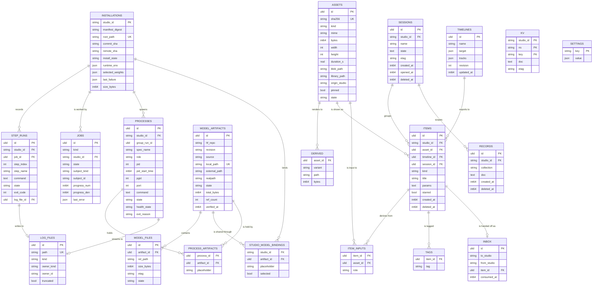

# Data Model

> Frozen design, 15 Sep 2026. This file is the contract.
> Do not edit to make an implementation pass — raise a finding instead.

One SQLite file holds every row; directories hold every byte. The database is the index for a lifecycle (installs, processes, jobs, weights) and a platform (state, records, assets, gallery, timelines) — small enough to snapshot in under a second, and never holding a video.

## 1 · What is stored, and what is derived

Three questions decide whether something is a row. Does the daemon need it after a restart? Can it be re-derived cheaply from a manifest or a probe? Would losing it lose the user's work? Anything answering "no, yes, no" is derived, which is why the catalogue itself has no table — studios, their build steps and their process specs are parsed from `studios/*.yaml` at startup, and a manifest digest on the installation records which version a checkout was built from.

**Derived: Studio**

Parsed from the manifest. A table would be a stale copy of a file the daemon already reads.

**Derived: ProcessSpec**

From `processes[]`. The *instance* is stored; the spec is read.

**Derived: PortLease**

In-memory allocator plus a `net.Listen` probe. `processes.port` already records what was used.

**Derived: download progress**

`stat` the `.part` files. A database does not make a pointless write worth making.

## 2 · Four clusters, joined at three places

Three joins carry the product's claims. `studio_model_bindings` makes "two studios, one download" true. `process_artifacts` makes "which model is this process holding" answerable while it runs. `item_inputs` makes provenance a graph — the thing no studio could record alone, because the earlier link happened somewhere else.

## 3 · ER diagram

`studio_id` is the primary key of `installations` and a foreign key everywhere else: a studio has at most one checkout on a machine, which is the constraint that removes all ambiguity about which build is live.

## 4 · Lifecycle tables

### installations

One row per studio materialised on this machine, keyed by `studio_id`.

| Field                                             | Notes                                                                                                                                                                                                                                                                                                                                                                                                                                   |
|---------------------------------------------------|-----------------------------------------------------------------------------------------------------------------------------------------------------------------------------------------------------------------------------------------------------------------------------------------------------------------------------------------------------------------------------------------------------------------------------------------|
| `manifest_digest`                                 | What this checkout was built from. A mismatch against the loaded manifest means "rebuild needed" — a quieter signal than an upstream change.                                                                                                                                                                                                                                                                                            |
| `commit_sha` · `remote_sha` · `remote_checked_at` | Local HEAD and the upstream tip. `update_available` is `remote_sha != commit_sha`; without both fields the question is unanswerable.                                                                                                                                                                                                                                                                                                    |
| `install_state`                                   | The canonical vocabulary from the PRD.                                                                                                                                                                                                                                                                                                                                                                                                  |
| `runtime_env`                                     | Resolved at the end of a successful build: venv path, python version, go version, tool versions, and the detected versions of any framework the manifest names — `torch 2.6.0`, `mlx 0.31.2`, the Metal version. This is what the studio page shows and what a "why is this slower than the README" question starts from. The declared `runtime` block itself is not stored: it is read from the manifest like everything else derived. |
| `selected_weights`                                | Placeholder → artifact id for `selectable` weights. This is how iris studio remembers which checkpoint to launch with.                                                                                                                                                                                                                                                                                                                  |
| `last_failure`                                    | `{phase, step_index, exit_code, log_file_id, message}`. The failure block renders straight from this.                                                                                                                                                                                                                                                                                                                                   |
| `size_bytes`                                      | Checkout plus build output. Excludes weights, which belong to the cache.                                                                                                                                                                                                                                                                                                                                                                |

### processes

One row per spawned process, not per studio — which is what makes a multi-process studio representable. `group_run_id` ties one launch together so the UI can say "the group is starting" while only the sidecar is up.

| Field                             | Notes                                                                                                                                                                         |
|-----------------------------------|-------------------------------------------------------------------------------------------------------------------------------------------------------------------------------|
| `spec_name` · `role`              | Which `processes[]` entry, and whether `main`, `sidecar`, `worker` or `oneshot`.                                                                                              |
| `pid` · `pid_start_time` · `pgid` | All three, all verified before adopting or signalling after a daemon restart. Storing `pid` alone eventually means SIGKILL to an unrelated process that inherited the number. |
| `command`                         | The fully substituted argv. Reproducing a failure starts with reading what actually ran.                                                                                      |
| `state` · `health_state`          | Separate, because healthy-then-unresponsive is a different thing from exited.                                                                                                 |
| `exit_reason`                     | `clean | crashed | health_timeout | killed_by_user | preempted | oom`. The UI's sentence is chosen from this, never guessed from a code.                                      |

**Indexes:** `idx_proc_live` over `state ∈ (starting, running, stopping)` for the top-bar indicator and the startup sweep; `idx_proc_studio` by `(studio_id, started_at DESC)` for history. No restart counter on a `main` process — it never auto-restarts, because a health probe must never be able to kill an eight-minute generation.**

    -- added 2026-09-15 for M2 (docs/decisions.md, "M2 supervision"). started_at, exited_at and
    -- exit_code are used by this section's prose and indexes but were missing from the ER list.
    -- studio_id has no REFERENCES installations(studio_id) yet: that table arrives in M3, which adds it.
    CREATE TABLE processes (
      id TEXT PRIMARY KEY,
      studio_id TEXT NOT NULL,
      group_run_id TEXT NOT NULL,
      spec_name TEXT NOT NULL,
      role TEXT NOT NULL CHECK (role IN ('main','sidecar','worker','oneshot')),
      pid INTEGER, pid_start_time INTEGER, pgid INTEGER,   -- all three verified before adopting or signalling
      port INTEGER,
      command TEXT NOT NULL,                -- the fully substituted argv, as a JSON array
      state TEXT NOT NULL CHECK (state IN ('queued','starting','running','stopping','exited','failed')),
      health_state TEXT,                    -- unknown | passing | failing
      exit_reason TEXT CHECK (exit_reason IN ('clean','crashed','health_timeout','killed_by_user','preempted','oom')),
      exit_code INTEGER,
      started_at INTEGER, exited_at INTEGER);
    CREATE INDEX idx_proc_live ON processes(state) WHERE state IN ('starting','running','stopping');
    CREATE INDEX idx_proc_studio ON processes(studio_id, started_at DESC);

### jobs, step_runs, log_files

`jobs` carries `kind` (`install | build | download | update | export | uninstall`), `studio_id` — present even when the subject is an artifact, because "what is this studio downloading" is a per-studio query — plus progress and `last_error`. `step_runs` is one row per executed build step, unique on `(studio_id, job_id, step_index)`, which is what lets Retry resume from the first step that has not succeeded; a `running` row found at startup becomes `interrupted`, never silently `failed`, because the distinction changes what Retry should do. `log_files` is an index row pointing at an append-only file; bytes never enter the database, and retention is `os.Remove` on the oldest five per studio, with `truncated` making head-and-tail elision honest in the UI.

    -- added 2026-09-15 for M2 (docs/decisions.md, "M2 supervision"). created_at is not in the ER
    -- list; retention ("the oldest five per studio") needs an order. studio_id is denormalised from
    -- the owner so retention is one query per studio rather than a join per owner kind.
    CREATE TABLE log_files (
      id TEXT PRIMARY KEY,
      path TEXT NOT NULL UNIQUE,            -- relative to the logs root, never absolute
      kind TEXT NOT NULL CHECK (kind IN ('run','build')),
      owner_kind TEXT NOT NULL CHECK (owner_kind IN ('process','step_run')),
      owner_id TEXT NOT NULL,
      studio_id TEXT NOT NULL,
      truncated INTEGER NOT NULL DEFAULT 0,
      created_at INTEGER NOT NULL);
    CREATE INDEX idx_logs_studio ON log_files(studio_id, created_at DESC);

## 5 · Platform tables

    -- sessions: every studio has this concept, so the platform owns it rather than each
    -- studio inventing a directory convention. This is what replaces sessions/*/setting.json.
    CREATE TABLE sessions (
      id TEXT PRIMARY KEY,
      studio_id TEXT NOT NULL,
      name TEXT NOT NULL,
      state TEXT NOT NULL DEFAULT '{}',   -- the studio's own shape: prompt, seed, dims, refs…
      etag TEXT NOT NULL,                 -- optimistic concurrency for two open tabs
      created_at INTEGER NOT NULL, opened_at INTEGER, deleted_at INTEGER);
    CREATE UNIQUE INDEX uq_session_name ON sessions(studio_id, name) WHERE deleted_at IS NULL;
    CREATE INDEX idx_session_recent ON sessions(studio_id, opened_at DESC) WHERE deleted_at IS NULL;

    -- singleton studio state: UI preferences, last opened session, panel widths
    CREATE TABLE kv (
      studio_id TEXT, ns TEXT, key TEXT,
      doc TEXT NOT NULL, etag TEXT NOT NULL, updated_at INTEGER NOT NULL,
      PRIMARY KEY (studio_id, ns, key)) WITHOUT ROWID;

    -- domain documents helmstudio deliberately does not model
    CREATE TABLE records (
      id TEXT PRIMARY KEY, studio_id TEXT NOT NULL, collection TEXT NOT NULL,
      doc TEXT NOT NULL, created_at INTEGER, updated_at INTEGER, deleted_at INTEGER);
    CREATE INDEX idx_rec_scan ON records(studio_id, collection, created_at DESC)
      WHERE deleted_at IS NULL;
    -- expression indexes created at install from the manifest's storage.collections
    -- CREATE INDEX idx_rec_h3_seed ON records(json_extract(doc,'$.seed')) WHERE studio_id='h3-studio';

    -- media index. Bytes are in directories; these are pointers plus facts.
    CREATE TABLE assets (
      id TEXT PRIMARY KEY,
      sha256 TEXT NOT NULL UNIQUE,        -- dedup is a constraint, not an algorithm
      kind TEXT NOT NULL CHECK (kind IN ('image','video','audio','other')),
      mime TEXT NOT NULL, bytes INTEGER NOT NULL,
      width INTEGER, height INTEGER, duration_s REAL, fps REAL,
      blob_path TEXT NOT NULL,              -- relative to the assets root, never absolute
      library_path TEXT,                    -- the human-readable hardlink
      origin_studio TEXT, pinned INTEGER NOT NULL DEFAULT 0,
      state TEXT NOT NULL DEFAULT 'ready',  -- ready | missing | corrupt
      created_at INTEGER, last_used_at INTEGER);

    CREATE TABLE derived (
      asset_id TEXT NOT NULL REFERENCES assets(id) ON DELETE CASCADE,
      variant TEXT NOT NULL,                -- thumb-320 | poster | waveform-800 | proxy-h264
      path TEXT NOT NULL, bytes INTEGER NOT NULL,
      PRIMARY KEY (asset_id, variant)) WITHOUT ROWID;

    -- the gallery
    CREATE TABLE items (
      id TEXT PRIMARY KEY, studio_id TEXT NOT NULL,
      session_id TEXT REFERENCES sessions(id) ON DELETE SET NULL,
      kind TEXT NOT NULL,
      asset_id TEXT NOT NULL REFERENCES assets(id) ON DELETE RESTRICT,
      timeline_id TEXT REFERENCES timelines(id),   -- set when this item is an export
      title TEXT, params TEXT NOT NULL DEFAULT '{}',
      starred INTEGER NOT NULL DEFAULT 0,
      created_at INTEGER NOT NULL, deleted_at INTEGER);
    CREATE INDEX idx_items_feed   ON items(created_at DESC)            WHERE deleted_at IS NULL;
    CREATE INDEX idx_items_studio ON items(studio_id, created_at DESC) WHERE deleted_at IS NULL;
    CREATE INDEX idx_items_asset  ON items(asset_id);

    -- provenance edges: the reason a central store exists
    CREATE TABLE item_inputs (
      item_id TEXT NOT NULL REFERENCES items(id) ON DELETE CASCADE,
      asset_id TEXT NOT NULL REFERENCES assets(id) ON DELETE RESTRICT,
      role TEXT NOT NULL,                   -- first_frame | last_frame | reference | audio_bed | clip
      PRIMARY KEY (item_id, asset_id, role)) WITHOUT ROWID;
    CREATE INDEX idx_inputs_asset ON item_inputs(asset_id);

    CREATE TABLE tags (
      item_id TEXT NOT NULL REFERENCES items(id) ON DELETE CASCADE,
      tag TEXT NOT NULL, PRIMARY KEY (item_id, tag)) WITHOUT ROWID;
    CREATE VIRTUAL TABLE items_fts USING fts5(title, prompt, content='', tokenize='porter unicode61');

    -- sequences: framework-owned, edited by the launcher or by helm-timeline
    CREATE TABLE timelines (
      id TEXT PRIMARY KEY, name TEXT NOT NULL,
      target TEXT NOT NULL,                  -- {width,height,fps,sample_rate}
      tracks TEXT NOT NULL,                  -- clips reference asset ids; never copies
      revision INTEGER NOT NULL DEFAULT 1,  -- optimistic concurrency + undo
      created_at INTEGER, updated_at INTEGER);

    CREATE TABLE inbox (
      id TEXT PRIMARY KEY, to_studio TEXT NOT NULL, from_studio TEXT NOT NULL,
      item_id TEXT NOT NULL REFERENCES items(id) ON DELETE CASCADE,
      role TEXT, created_at INTEGER, consumed_at INTEGER);
    CREATE INDEX idx_inbox_pending ON inbox(to_studio, created_at) WHERE consumed_at IS NULL;

**Managed and linked weights are the same row with a different `source`.** A managed artifact owns the bytes under `models/<dest>`; a linked one has that path as a symlink to a directory the user already had, with `external_path` as they typed it and `realpath` as it resolved. Everything downstream — bindings, `{models.x}` substitution, the disk view, the launch check — reads one field and behaves identically, which is the point of putting the symlink in the cache rather than special-casing paths at spawn time. Two rules make it safe: a linked directory is read-only to helmstudio, and no delete path ever follows a symlink.**

All studio state goes through the SDK

A studio does not keep its own store. Session settings, domain documents and preferences are written through `sessions`, `records` and `kv`, and the provider decides where the bytes land — `helm.db` under the daemon, `./.helm/helm.db` standalone. That is what makes one backup, one migration path and one crash-safety implementation possible instead of one per studio, and it is why `sessions` is a table here rather than a convention each author reinvents. Bytes still stay in directories; this is about rows.

**No stored reference count on an asset.** A counter drifts the first time a transaction is interrupted; the truth is derivable exactly from `items` and `item_inputs`, and a timeline's clips are `item_inputs` rows on its export, so a sequence in progress holds its footage through the same mechanism.**

## 6 · Media on disk

    ~/.helmstudio/
    ├── helm.db                          # every row above
    ├── assets/
    │   ├── blobs/7c/1f/7c1fa9…e2.mp4    # bytes, once, named by sha256, real extension kept
    │   └── derived/7c1fa9…e2/{thumb-320.jpg, poster.jpg, proxy.mp4}
    ├── library/h3-studio/2026-09/cafe-window-drift.mp4   # hardlink — same inode, no copy
    ├── models/MiniMax-H3/…              # weights
    ├── stage/<studio>/<group_run>/      # studio writes here; adopted by hardlink; cleared on stop
    └── studios/<id>/{src,logs}/

No path in this document is hardcoded

The tree is written as `~/.helmstudio/` for readability, but four roots resolve separately through an OS-appropriate directories helper — data, cache, logs and the user-visible library — plus models as a fifth. `settings` stores a root only when the user overrides it, so an absent key means "use the OS default" and a settings row copied between machines still resolves correctly. `assets.blob_path` being relative to the assets root is what makes all of this work without rewriting rows.

Two paths, one copy. The content-addressed path gives idempotent writes, dedup as a uniqueness constraint and detectable corruption; the library path gives a person a tree they can browse, drag from and back up. `assets.blob_path` is stored relative to the assets root so moving the library to an external drive is a settings change rather than a rewrite of every row. Backup is exactly two things: `helm.db` via `VACUUM INTO`, and `assets/blobs/` — `derived/` and `stage/` are regenerable by definition, which is most of why they are separate directories.

`helmstudio fsck` reconciles both directions, because a person will move something in Finder and that is not corruption. A row with no file sets `assets.state = 'missing'` and the gallery keeps the item, greyed, with its prompt and params intact — losing the record of what you made is worse than losing the file. A file with no row is reported as reclaimable and never deleted silently.

## 7 · State machines

### installations.install_state

| From               | Event                   | To                 | Side effect                                                        |
|--------------------|-------------------------|--------------------|--------------------------------------------------------------------|
| —                  | install requested       | `cloning`          | Job(install); root created                                         |
| `cloning`          | clone ok                | `cloned`           | `commit_sha`, submodule shas written                               |
| `cloning`          | git error               | `failed_clone`     | `last_failure`; root left for inspection                           |
| `cloned`           | build starts            | `building`         | `step_runs` created `pending`                                      |
| `building`         | all steps succeed       | `built`            | `runtime_env` resolved                                             |
| `building`         | step exits non-zero     | `failed_build`     | step `failed`; `last_failure` carries the log id                   |
| `building`         | daemon killed           | `failed_build`     | startup sweep marks the live step `interrupted`                    |
| `failed_build`     | retry                   | `building`         | resume at the first non-succeeded index                            |
| `built`            | weights declared        | `fetching_weights` | bindings created; a download Job per missing artifact              |
| `fetching_weights` | all required ready      | `ready`            | Launch becomes available                                           |
| `fetching_weights` | required download fails | `failed_weights`   | artifact stays resumable; nothing deleted                          |
| `ready`            | remote ref moved        | `update_available` | non-destructive; still launchable                                  |
| any                | uninstall               | `removing`         | group stopped, bindings deleted, ref counts drop, checkout removed |

### model_artifacts.state

| From          | Event                                | To              | Side effect                                                                                                                                           |
|---------------|--------------------------------------|-----------------|-------------------------------------------------------------------------------------------------------------------------------------------------------|
| —             | binding declared, no match           | `declared`      | row created, `ref_count = 1`, `source = 'managed'`                                                                                                    |
| `declared`    | user points at an existing directory | `linked`        | `source = 'linked'`; `external_path` and `realpath` written; `models/<dest>` created as a symlink; declared files checked for presence and rough size |
| `linked`      | target unreadable or gone            | `missing`       | launch refuses with the expected path; Relink or Download offered; install state untouched                                                            |
| `missing`     | volume remounted, files present      | `linked`        | `verified_at` refreshed                                                                                                                               |
| `linked`      | unlink                               | row deleted     | **symlink removed only.** The user's directory is never deleted, and reclaim excludes linked rows entirely                                            |
| —             | binding declared, match exists       | unchanged       | `ref_count++` only — **the dedup path**                                                                                                               |
| `declared`    | listing fetched                      | `downloading`   | file rows and total bytes written                                                                                                                     |
| `declared`    | HF 401/403                           | `auth_required` | token prompt; install not failed                                                                                                                      |
| `downloading` | network error                        | `interrupted`   | `.part` kept; Job retries with backoff                                                                                                                |
| `interrupted` | retry or restart                     | `downloading`   | URL re-resolved; range-resume from the `.part` length                                                                                                 |
| `downloading` | all files complete                   | `ready`         | `.part` renamed; sizes and etags checked                                                                                                              |
| `ready`       | `ref_count` hits 0                   | `orphaned`      | not deleted; eligible for reclaim                                                                                                                     |

### processes and the group

| From       | Event                                  | To         | Side effect                                                                   |
|------------|----------------------------------------|------------|-------------------------------------------------------------------------------|
| —          | launch requested                       | `queued`   | one `group_run_id` for every member                                           |
| `queued`   | heavy slot free, dependencies ready    | `starting` | port assigned, argv substituted, own pgid                                     |
| `starting` | health passes                          | `running`  | dependents leave `queued`; artifacts' `last_used_at` touched                  |
| `starting` | budget exhausted                       | `failed`   | `health_timeout`; group torn down in reverse                                  |
| `running`  | health check fails                     | `running`  | health degraded. **No restart** — a long generation must survive a slow probe |
| `running`  | `main` exits unexpectedly              | `failed`   | group stopped; last 200 lines surfaced; Restart offered, never automatic      |
| `running`  | `sidecar` exits, `restart: on-failure` | `starting` | backoff, max three in ten minutes, then the group fails                       |
| `running`  | another heavy group confirmed          | `stopping` | `preempted`; the new group waits for ports to clear                           |
| `running`  | restart, identity matches              | `running`  | re-adopted; survivors are not orphans                                         |
| `running`  | restart, process gone or mismatched    | `exited`   | swept as `crashed`; nothing is signalled                                      |

### assets.state

| From      | Event                                      | To          | Side effect                                                         |
|-----------|--------------------------------------------|-------------|---------------------------------------------------------------------|
| —         | adopt or upload, hash unseen               | `ready`     | blob hardlinked in, library link made, derived queued               |
| —         | adopt, hash exists                         | unchanged   | staged file unlinked. **Dedup as a uniqueness constraint**          |
| `ready`   | fsck finds no file                         | `missing`   | items stay, greyed, with params intact; Locate offered              |
| `missing` | file returns, hash matches                 | `ready`     | derived regenerated                                                 |
| `ready`   | explicit Verify mismatches                 | `corrupt`   | flagged; never auto-refetched, since a render cannot be regenerated |
| `ready`   | no item or input references it, not pinned | reclaimable | listed with bytes; deleted only on an explicit action               |

## 8 · The queries that pay for a database

    -- reclaim never touches a linked directory: source='linked' is excluded everywhere
    SELECT id, local_path, total_bytes FROM model_artifacts
    WHERE ref_count = 0 AND source = 'managed';   -- unlinking a linked one removes the symlink only

    -- reclaim: every asset nothing points at. The entire garbage collector.
    SELECT a.id, a.bytes FROM assets a
    WHERE a.pinned = 0
      AND NOT EXISTS (SELECT 1 FROM items i       WHERE i.asset_id = a.id AND i.deleted_at IS NULL)
      AND NOT EXISTS (SELECT 1 FROM item_inputs x WHERE x.asset_id = a.id);

    -- the gallery feed at any scope, with its thumbnail, in one round trip
    SELECT i.id, i.title, i.kind, i.created_at, a.blob_path, d.path AS thumb
    FROM items i JOIN assets a ON a.id = i.asset_id
    LEFT JOIN derived d ON d.asset_id = a.id AND d.variant = 'thumb-320'
    WHERE i.deleted_at IS NULL AND (?1 IS NULL OR i.studio_id = ?1)
    ORDER BY i.created_at DESC LIMIT 50;

    -- downstream provenance: everything ever made from this reference image
    WITH RECURSIVE lineage(item_id) AS (
      SELECT item_id FROM item_inputs WHERE asset_id = ?1
      UNION
      SELECT x.item_id FROM item_inputs x
        JOIN items i ON i.id IN (SELECT item_id FROM lineage)
       WHERE x.asset_id = i.asset_id)
    SELECT * FROM lineage;

    -- "that café video, whatever studio made it"
    SELECT i.* FROM items_fts f JOIN items i ON i.rowid = f.rowid
    WHERE items_fts MATCH 'café NEAR window' ORDER BY rank LIMIT 25;

    -- a studio's own records, from the closed filter language — values always bound
    SELECT id, doc FROM records
    WHERE studio_id = ?1 AND collection = ?2 AND deleted_at IS NULL
      AND json_extract(doc,'$.seed') = ?3
    ORDER BY created_at DESC LIMIT ?4;

The recursive provenance query is the clearest case for the engine: in a hand-rolled index it is a graph traversal you write, test and maintain; here it was free the moment the edges became rows.

## 9 · Engine, pragmas, migrations

**Driver: `modernc.org/sqlite`** — pure Go, so `CGO_ENABLED=0` keeps cross-compilation, CI and the Electron build trivial — behind `database/sql`, so swapping to the cgo driver is a one-line change if profiling ever demands it. The stdlib-only rule is scoped explicitly to the studios, not the daemon; a component that owns a user's entire generation history has outgrown it.**

    dsn := "file:" + path + "?_pragma=journal_mode(WAL)&_pragma=busy_timeout(5000)" +
           "&_pragma=synchronous(NORMAL)&_pragma=foreign_keys(ON)"
    w, _ := sql.Open("sqlite", dsn); w.SetMaxOpenConns(1)   // every mutation serialises, no app mutex
    r, _ := sql.Open("sqlite", dsn); r.SetMaxOpenConns(max(4, runtime.NumCPU()))

| Pragma                | Why                                                                                                                                       |
|-----------------------|-------------------------------------------------------------------------------------------------------------------------------------------|
| `journal_mode(WAL)`   | Readers and the writer proceed concurrently; without it the gallery blocks every time a render is recorded.                               |
| `synchronous(NORMAL)` | Durable across process crashes; loses at most the last transaction on a power cut. The right trade for a local creative tool.             |
| `busy_timeout(5000)`  | A transient lock waits instead of erroring. With one writer it should never fire — when it does, something is wrong and you want to know. |
| `foreign_keys(ON)`    | Off by default in SQLite. Without it, every `ON DELETE RESTRICT` protecting an asset a gallery item references does nothing.              |

**Migrations** use `PRAGMA user_version` with an ordered list of functions, each in one transaction, so a failure leaves the version untouched and the daemon refuses to start rather than running half-migrated; a version higher than the binary's is also refused, so a downgrade fails loudly. The embedded provider inside a standalone studio carries **the same DDL and the same version sequence**, which is what makes later adoption an import rather than a merge — and the daemon refuses to import a schema newer than it knows, telling the user to update rather than silently discarding fields.**

`VACUUM INTO` takes a consistent single-file backup without stopping writers, and is also the honest answer to "how do I move my library to a new Mac": that file plus `assets/blobs/`.

## 10 · Worked examples

### Two studios, one weight

h3 studio installs first and declares `MiniMaxAI/MiniMax-H3`. No artifact matches `(hf_repo, revision)`, so one is created with `ref_count = 1` and a binding at placeholder `h3`. A later studio declaring the same repo and revision creates only a second binding and takes the count to 2; nothing downloads. Uninstalling h3 studio cascades its binding, drops the count to 1, and leaves every byte in place.

### A three-process studio launching

One launch mints a `group_run_id` and writes two rows: `engine` (`sidecar`, `heavy`, port 8781) enters `starting`; `studio` (`main`, `depends_on: [engine]`) sits `queued` until the engine's health passes. The on-demand `batch` worker gets a row only when started, sharing the same group. Stop walks the group in reverse. The top bar shows one entry, because the group is the unit the user thinks in.

### A chained render, end to end

iris studio adopts a still: an `assets` row, a blob, a library hardlink, a thumbnail queued, and an `items` row with its prompt in `params`. The user sends it to h3 studio — an `inbox` row. h3 uses it as a first frame and records its take with one `item_inputs` row at role `first_frame`. Later both clips land in a sequence: a `timelines` row whose `tracks` reference the asset ids. Export creates a Job, adopts the output as a new asset, and writes an `items` row with `timeline_id` set and one `item_inputs` row per clip — so the lineage from a prompt in one studio to a finished sequence is a single recursive query.

## 11 · What we deliberately do not store

- **Anything a studio owns internally.** Its sessions, prompts, seeds and working files stay in its own directories in its own shape. What a studio wants centrally it writes through `records`, on purpose.
- **Log bytes.** Append-only files with an index row.
- **Media and weight bytes, and per-chunk progress.** The filesystem is the source of truth; progress is `stat`.
- **Secrets.** The Hugging Face token is in the Keychain; the row records only that one exists and when.
- **Telemetry.** No usage counts, no generation counts, no timings beyond what a running job needs to show its own progress.
- **Anything the Electron shell knows.** Window bounds, update channel and the menu-bar preference live in the app's own user data; a second settings store would be a second source of truth.
